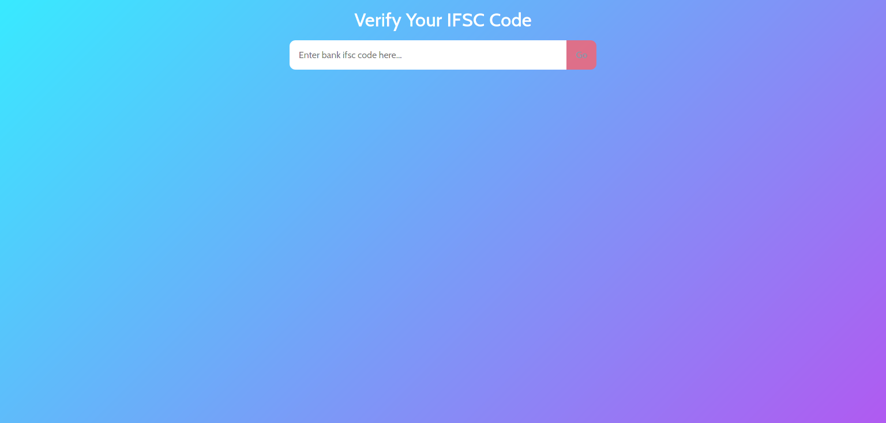

# verify-ifsc

A Simple React App setup without CRA using parcel,babel, eslint and prettier.

# Description

It makes use of Razorpay API to validate ifsc codes and display the information about the branch and bank related to the particular ifsc code.

# Tools

- React
- HTML
- CSS
- JavaScript
- Reach Router
- EmotionJs

# What did I learn?

With the help of this project, i learned how to setup a React Project from scratch using parcel and babel. In addition, i learned how to write css in js using emotionJs. Also, understood the importance of eslint and prettier in a project.

# What problem does it solve?

It makes it easier to verify whether the ifsc code is valid or not. Also one can view other details related to the bank.

# Screenshot

